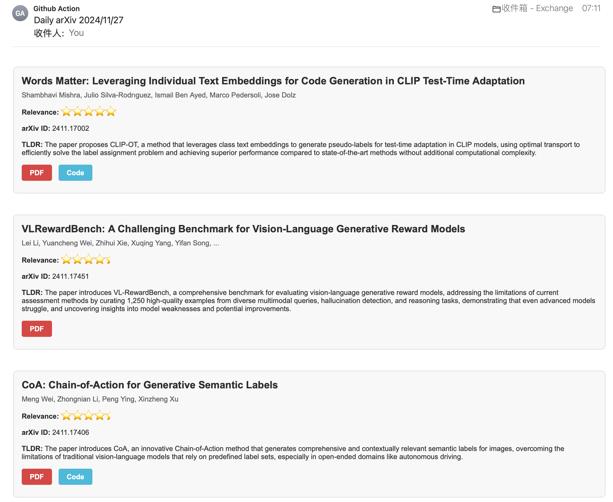
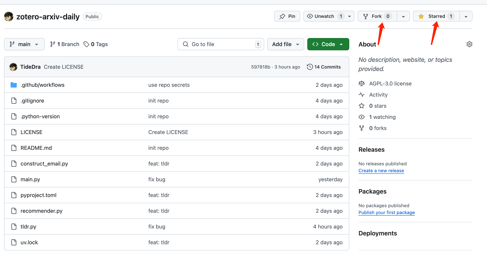
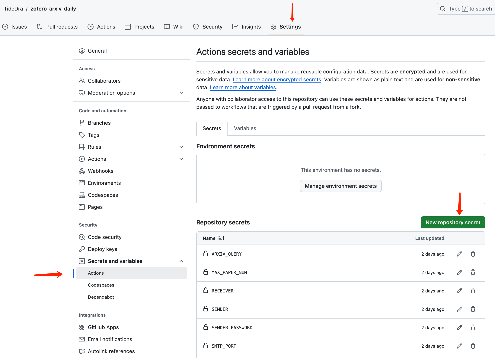
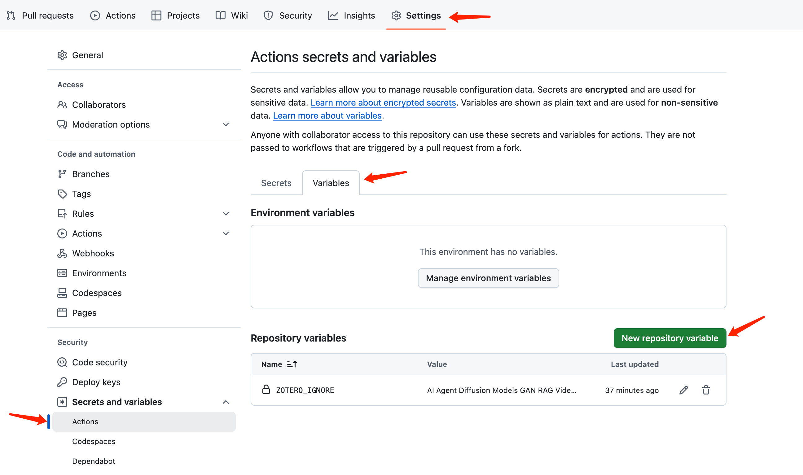
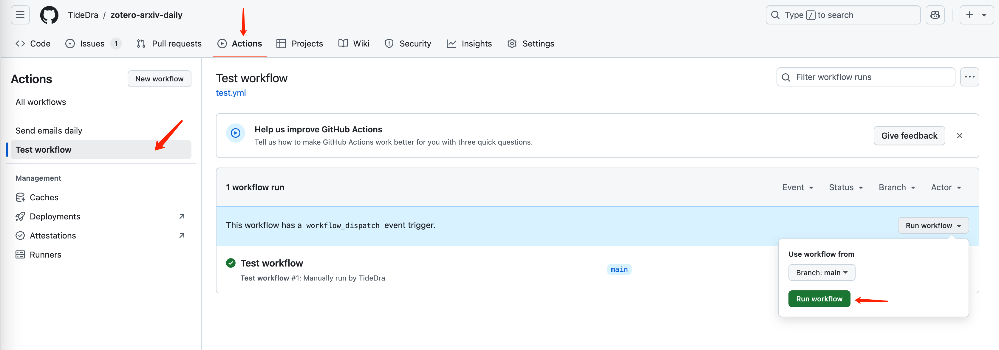
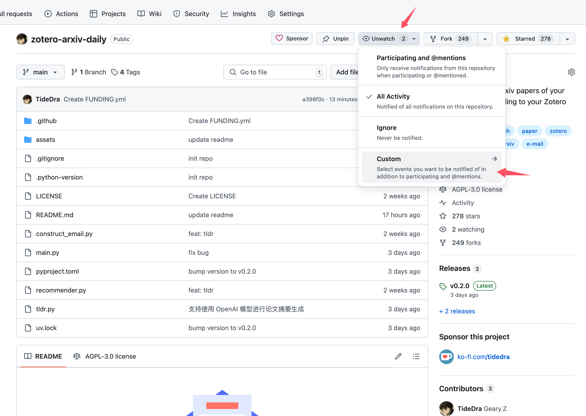

<p align="center">
  <a href="" rel="noopener">
 </a>
</p>

<h3 align="center">Zotero-arXiv-Daily</h3>

<div align="center">

  []()
  
  [](https://github.com/TideDra/zotero-arxiv-daily/issues)
  [](https://github.com/TideDra/zotero-arxiv-daily/pulls)
  [](/LICENSE)
  [](https://api.gitsponsors.com/api/badge/link?p=PKMtRut1dWWuC1oFdJweyDSvJg454/GkdIx4IinvBblaX2AY4rQ7FYKAK1ZjApoiNhYEeduIEhfeZVIwoIVlvcwdJXVFD2nV2EE5j6lYXaT/RHrcsQbFl3aKe1F3hliP26OMayXOoZVDidl05wj+yg==)

</div>

---

<p align="center"> Recommend new arxiv papers of your interest daily according to your Zotero library.
    <br> 
</p>

> [!IMPORTANT]
> Please keep an eye on this repo, and merge your forked repo in time when there is any update of this upstream, in order to enjoy new features and fix found bugs.

## 🧐 About <a name = "about"></a>

> Track new scientific researches of your interest by just forking (and staring) this repo!😊

*Zotero-arXiv-Daily* finds arxiv papers that may attract you based on the context of your Zotero library, and then sends the result to your mailbox📮. It can be deployed as Github Action Workflow with **zero cost**, **no installation**, and **few configuration** of Github Action environment variables for daily **automatic** delivery.

## ✨ Features
- Totally free! All the calculation can be done in the Github Action runner locally within its quota (for public repo).
- AI-generated TL;DR for you to quickly pick up target papers.
- Affiliations of the paper are resolved and presented.
- Links of PDF and code implementation (if any) presented in the e-mail.
- List of papers sorted by relevance with your recent research interest.
- Fast deployment via fork this repo and set environment variables in the Github Action Page.
- Support LLM API for generating TL;DR of papers.
- Ignore unwanted Zotero papers using glob pattern.
- Support multiple sources of papers to retrieve:
  - arxiv
  - biorxiv
  - medrxiv

## 📷 Screenshot


## 🚀 Usage
### Quick Start
1. Fork (and star😘) this repo.


2. Set Github Action environment variables.


Below are all the secrets you need to set. They are invisible to anyone including you once they are set, for security.

| Key |Description | Example |
| :---  | :---  | :--- |
| ZOTERO_ID  | User ID of your Zotero account. **User ID is not your username, but a sequence of numbers**Get your ID from [here](https://www.zotero.org/settings/security). You can find it at the position shown in this [screenshot](https://github.com/TideDra/zotero-arxiv-daily/blob/main/assets/userid.png). | 12345678  |
| ZOTERO_KEY | An Zotero API key with read access. Get a key from [here](https://www.zotero.org/settings/security).  | AB5tZ877P2j7Sm2Mragq041H   |
| SENDER | The email account of the SMTP server that sends you email. | abc@qq.com |
| SENDER_PASSWORD | The password of the sender account. Note that it's not necessarily the password for logging in the e-mail client, but the authentication code for SMTP service. Ask your email provider for this.   | abcdefghijklmn |
| RECEIVER | The e-mail address that receives the paper list. | abc@outlook.com |
| OPENAI_API_KEY | API Key when using the API to access LLMs. You can get FREE API for using advanced open source LLMs in [SiliconFlow](https://cloud.siliconflow.cn/i/b3XhBRAm). | sk-xxx |
| OPENAI_API_BASE | API URL when using the API to access LLMs. | https://api.siliconflow.cn/v1 |

Then you should also set a public variable `CUSTOM_CONFIG` for your custom configuration.


Paste the following content into the value of `CUSTOM_CONFIG` variable:
```yaml
zotero:
  user_id: ${oc.env:ZOTERO_ID}
  api_key: ${oc.env:ZOTERO_KEY}
  include_path: null

email:
  sender: ${oc.env:SENDER}
  receiver: ${oc.env:RECEIVER}
  smtp_server: smtp.qq.com
  smtp_port: 465
  sender_password: ${oc.env:SENDER_PASSWORD}

llm:
  api:
    key: ${oc.env:OPENAI_API_KEY}
    base_url: ${oc.env:OPENAI_API_BASE}
  generation_kwargs:
    model: gpt-4o-mini

source:
  arxiv:
    category: ["cs.AI","cs.CV","cs.LG","cs.CL"]

executor:
  debug: ${oc.env:DEBUG,null}
  source: ['arxiv']
```
>[!NOTE]
> `${oc.env:XXX,yyy}` means the value of the environment variable `XXX`. If the variable is not set, the default value `yyy` will be used.

Here is the full configuration, `???` means the value must be filled in:
```yaml
zotero:
  user_id: ??? # User ID of your Zotero account.
  api_key: ??? # An Zotero API key with read access.
  include_path: null # A glob pattern marking the Zotero collections that should be included. Example: "2026/survey/**"

source:
  arxiv:
    category: null # The categories of target arxiv papers. Find the abbr of your research area from [here](https://arxiv.org/category_taxonomy). Example: ["cs.AI","cs.CV","cs.LG","cs.CL"]
  biorxiv:
    category: null # The categories of target biorxiv papers. Find categories from [here](https://www.biorxiv.org/). Example: ["biochemistry","animal behavior and cognition"]
  medrxiv:
    category: null # The categories of target medrxiv papers. Find categories from [here](https://www.medrxiv.org/) Example: ["psychiatry and clinical psychology", "neurology"]

email:
  sender: ??? # The email account of the SMTP server that sends you email. Example: abc@qq.com
  receiver: ??? # The email account that receives the paper list. Example: abc@outlook.com
  smtp_server: ??? # The SMTP server that sends the email. Ask your email provider (Gmail, QQ, Outlook, ...) for its SMTP server. Example: smtp.qq.com
  smtp_port: ??? # The port of SMTP server. Example: 465
  sender_password: ??? # The password of the sender account. Note that it's not necessarily the password for logging in the e-mail client, but the authentication code for SMTP service. Ask your email provider for this. Example: abcdefghijklmn

llm:
  api:
    key: ??? # API Key of your LLM API. Example: sk-xxx
    base_url: ??? # API URL of your LLM API. Example: https://api.openai.com/v1
  generation_kwargs:
  # Arguments for the LLM API. See [here](https://platform.openai.com/docs/api-reference/chat/create) for more details.
    max_tokens: 16384
    model: ???
  language: English # Preferred language for the TL;DR. Example: English

reranker:
  local:
    model: jinaai/jina-embeddings-v5-text-nano # The Hugging Face model name of the local embedding model. Example: jinaai/jina-embeddings-v5-text-nano
    encode_kwargs:
    # The kwargs for the encode method of the local embedding model. Details see [here](https://www.sbert.net/docs/package_reference/SentenceTransformer.html#sentence_transformers.SentenceTransformer.encode)
      task: retrieval
      prompt_name: document
  api:
    key: null # API Key of your embedding model API. Example: sk-xxx
    base_url: null # API URL of your embedding model API. Example: https://api.openai.com/v1
    model: null # The model name of the embedding model. Example: text-embedding-3-large

executor:
  debug: false # Whether to use debug mode. Example: true
  send_empty: false # Whether to send an empty email even if no new papers today. Example: true
  max_workers: 10 # Concurrent workers for processing papers. Example: 10
  max_paper_num: 100 # The maximum number of the papers presented in the email. Example: 100
  source: ??? # The sources of papers to retrieve. Example: ['arxiv','biorxiv','medrxiv']
  reranker: local # The reranker to use. Example: 'local' or 'api'
```

That's all! Now you can test the workflow by manually triggering it:


> [!NOTE]
> The Test-Workflow Action is the debug version of the main workflow (Send-emails-daily), which always retrieve 5 arxiv papers regardless of the date. While the main workflow will be automatically triggered everyday and retrieve new papers released yesterday. There is no new arxiv paper at weekends and holiday, in which case you may see "No new papers found" in the log of main workflow.

Then check the log and the receiver email after it finishes.

By default, the main workflow runs on 22:00 UTC everyday. You can change this time by editting the workflow config `.github/workflows/main.yml`.

### Local Running
Supported by [uv](https://github.com/astral-sh/uv), this workflow can easily run on your local device if uv is installed:
```bash
# set all the environment variables
# export ZOTERO_ID=xxxx
# ...
cd zotero-arxiv-daily
uv run main.py
```

## 🚀 Sync with the latest version
This project is in active development. You can subscribe this repo via `Watch` so that you can be notified once we publish new release.




## 📖 How it works
*Zotero-arXiv-Daily* firstly retrieves all the papers in your Zotero library and all the papers released in the previous day, via corresponding API. Then it calculates the embedding of each paper's abstract via an embedding model. The score of a paper is its weighted average similarity over all your Zotero papers (newer paper added to the library has higher weight). The TLDR of each paper is generated by LLM, given the text extracted by pymupdf4llm.

## 📌 Limitations
- The recommendation algorithm is very simple, it may not accurately reflect your interest. Welcome better ideas for improving the algorithm!
- High `MAX_PAPER_NUM` can lead the execution time exceed the limitation of Github Action runner (6h per execution for public repo, and 2000 mins per month for private repo). Commonly, the quota given to public repo is definitely enough for individual use. If you have special requirements, you can deploy the workflow in your own server, or use a self-hosted Github Action runner, or pay for the exceeded execution time.

## 👯‍♂️ Contribution
Any issue and PR are welcomed! But remember that **each PR should merge to the `dev` branch**.

## 📃 License
Distributed under the AGPLv3 License. See `LICENSE` for detail.

## ❤️ Acknowledgement
- [pyzotero](https://github.com/urschrei/pyzotero)
- [arxiv](https://github.com/lukasschwab/arxiv.py)
- [sentence_transformers](https://github.com/UKPLab/sentence-transformers)

## ☕ Buy Me A Coffee
If you find this project helpful, welcome to sponsor me via WeChat or via [ko-fi](https://ko-fi.com/tidedra).


## 🌟 Star History

[](https://star-history.com/#TideDra/zotero-arxiv-daily&Date)
